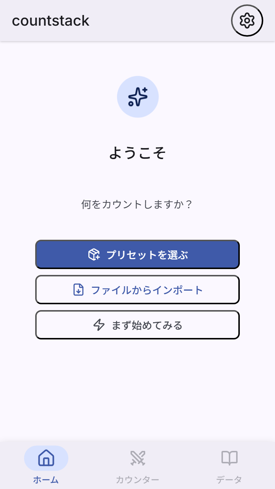
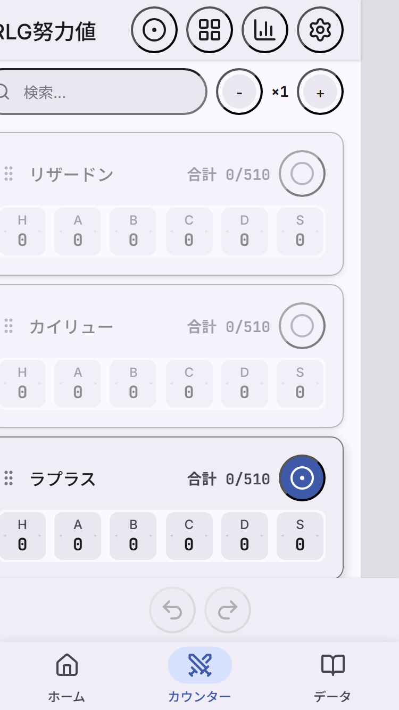
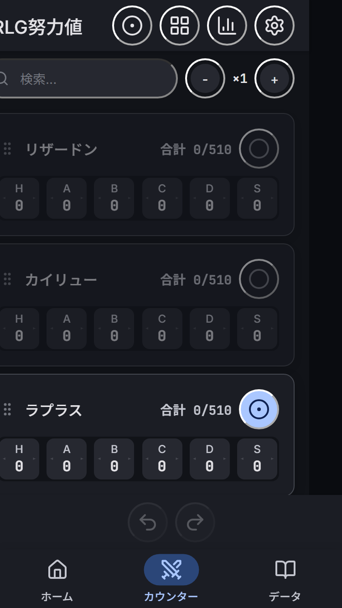
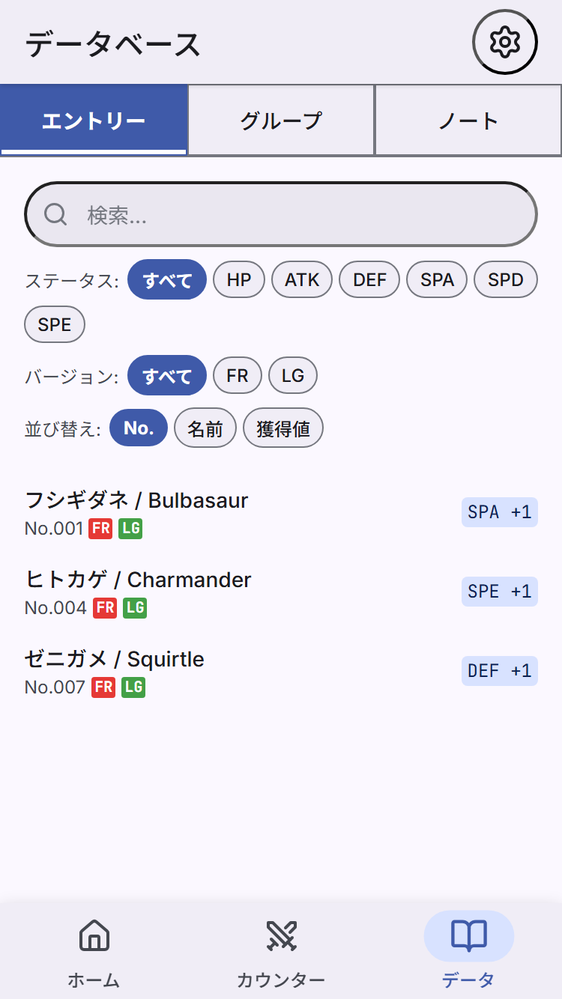
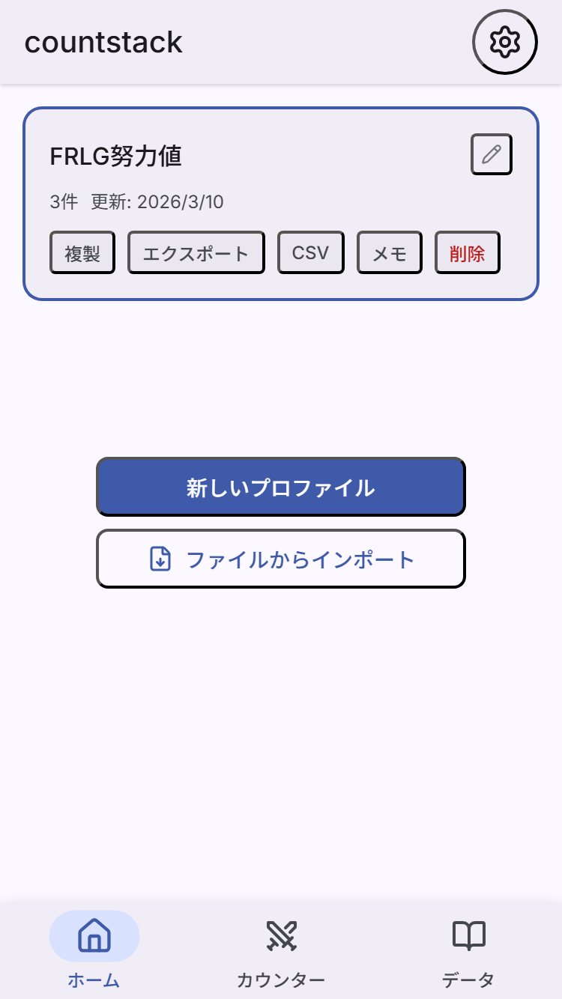

[English](README.en.md)

# countstack-presets

[**countstack**](https://countstack.erutobusiness.workers.dev/) のプリセットデータを管理するリポジトリです。

**[-> アプリを使う](https://countstack.erutobusiness.workers.dev/)**

## countstack とは

countstack は、あらゆるカウント作業に対応できる汎用カウンター/トラッカー PWA です。
プリセット（JSON）を読み込むことで、ポケモン努力値・筋トレ・勉強記録など、さまざまな用途に特化したカウンターとして機能します。

### 主な特徴

- **プリセットシステム** — 用途に合わせたカウンター構成・データベース・倍率・アイテムを JSON で定義
- **イベントソーシング** — 全操作を記録。何手でも Undo/Redo 可能
- **ソース検索 & 自動加算** — データベースからソースを選ぶと値が自動で加算される
- **倍率合成** — 複数の倍率アイテムを乗算合成（2x2=4倍）
- **目標管理 & クリップ通知** — カウンターごとの上限と合計上限を監視
- **オフライン完全対応** — PWA。アカウント不要、データはすべてローカル保存
- **ダークモード対応** — ライト/ダーク自動切替
- **日本語 / 英語** — 完全な多言語対応
- **JSON / CSV エクスポート** — 無料で全データをエクスポート可能

### スクリーンショット

<table>
  <tr>
    <td></td>
    <td></td>
    <td></td>
  </tr>
  <tr>
    <td align="center">ウェルカム</td>
    <td align="center">カウンター（ライト）</td>
    <td align="center">カウンター（ダーク）</td>
  </tr>
  <tr>
    <td></td>
    <td></td>
    <td></td>
  </tr>
  <tr>
    <td align="center">データベース</td>
    <td align="center">ホーム</td>
    <td></td>
  </tr>
</table>

## 使い方

1. [countstack](https://countstack.erutobusiness.workers.dev/) にアクセス
2. 「プリセットを選ぶ」からプリセットをダウンロード
3. プロファイルを作成してカウント開始

PWA なのでホーム画面に追加すればネイティブアプリのように使えます。

## 公開プリセット

| ID | 名前 | カウンター数 | エントリ数 | 説明 |
|----|------|:-----------:|:---------:|------|
| `frlg` | ポケモン FRLG | 6 | 387 | ファイアレッド・リーフグリーンの努力値トレーニング |
| `workout` | 筋トレ Volume Tracker | 6 | 44 | 部位別の週間トレーニングボリューム管理 |
| `study` | 勉強トラッカー | 5 | 31 | 教科別の学習量を可視化・管理 |

## プリセットを作りたい方へ

自分だけのプリセットを作って PR で追加できます。

1. `presets/` 以下にディレクトリを作成（例: `presets/my-game/`）
2. `preset.json` を作成（スキーマ: `schema/preset.schema.json`）
3. `registry.json` にエントリを追加
4. Pull Request を送信

詳しくは **[CONTRIBUTING.md](CONTRIBUTING.md)** をご覧ください。フィールド定義、最小構成の例、バリデーション方法などを記載しています。

### ディレクトリ構成

```
presets/
  frlg/preset.json         # ポケモン FRLG
  workout/preset.json      # 筋トレ
  study/preset.json        # 勉強
schema/
  preset.schema.json       # プリセットの JSON Schema
  registry.schema.json     # レジストリの JSON Schema
scripts/
  validate-pr.mjs          # CI バリデーションスクリプト
  generate-pokemon-db.ts   # ポケモンデータ生成
  build-preset.ts          # プリセットビルドヘルパー
registry.json              # プリセット一覧（アプリが読み込む）
```

### ローカルバリデーション

```bash
npm install --no-save ajv ajv-formats
node scripts/validate-pr.mjs
```

## ライセンス

このリポジトリとデータは countstack での使用を目的として提供されています。
